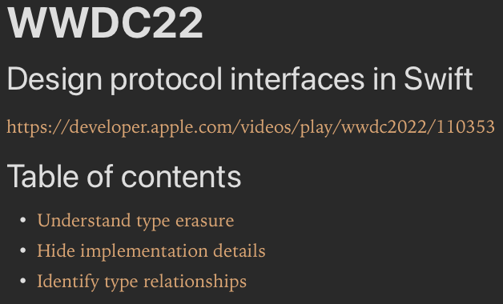
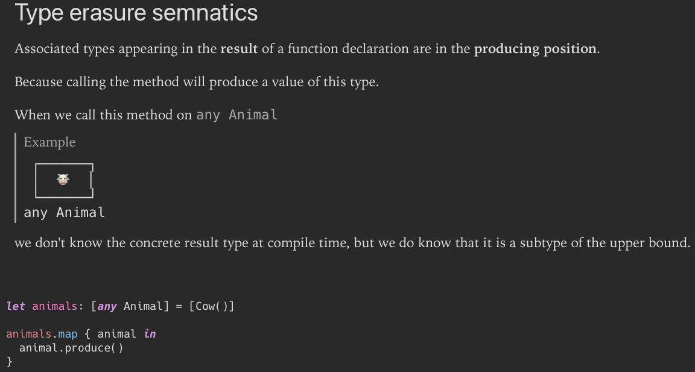
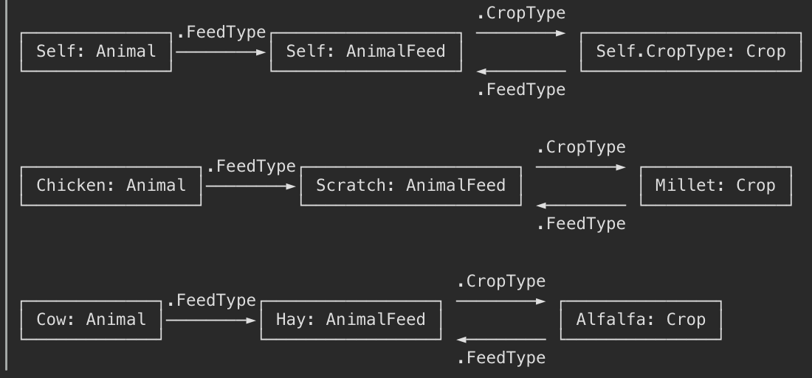

# WWDC22 - Design protocol interfaces in Swift

Xcode Playground that represents the session about designing protocol interfaces.

 [https://developer.apple.com/videos/play/wwdc2022/110353](https://developer.apple.com/videos/play/wwdc2022/110353)

